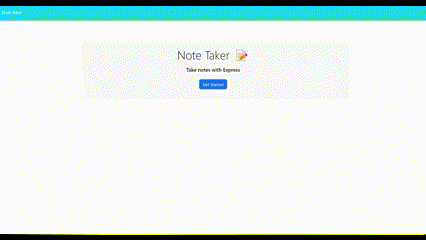

# Express.js Note Taker

## Description
This project involves building the backend for an existing frontend application. The backend for this note-taking app was built using JavaScript, JSON, and node.js.

Once the application is initialized, users are directed to a notetaking landing page. After clicking the "Get Started" button, users are presented with previous notes on the left, and a UI to write a new note. Users will then enter a title and some text and save the note. The new note will appear under the existing saved notes.

## Usage
In order to use this application, you must have node.js installed on your machine. You will also need a package.json with the required dependencies. Before installing dependencies, run "npm init" to create a package.json file. Also before installing npm dependencies, make sure you have a .gitignore file that includes node_modules/ and .DS_Store/. After running npm init, then run "npm install" to install the necessary dependencies.

The GIF below shows the functionality of the notetaking application.

## Installation
1. Clone the repository to your machine
2. Copy the files to your own repository
3. Conduct the git add, commit, and push commands to update your repository with the copied files
4. Modify the code to meet your needs
5. Commit and push your changes

## Links
- [GitHub Repository](https://github.com/hwoolford/express.js-note-taker) 
- [Deployed Application]() Coming Soon!

## Acknowledgements
- UUID Dependency information from [Node.js Crash Course](https://youtu.be/fBNz5xF-Kx4)

- I would like to acknowledge the assistance provided by Xpert, an AI Learning Assistant, in providing guidance and support throughout the development of this project. Xpert's insights and suggestions were invaluable in helping me overcome challenges and improve the quality of my work. (Acknowledgement written by Xpert)

